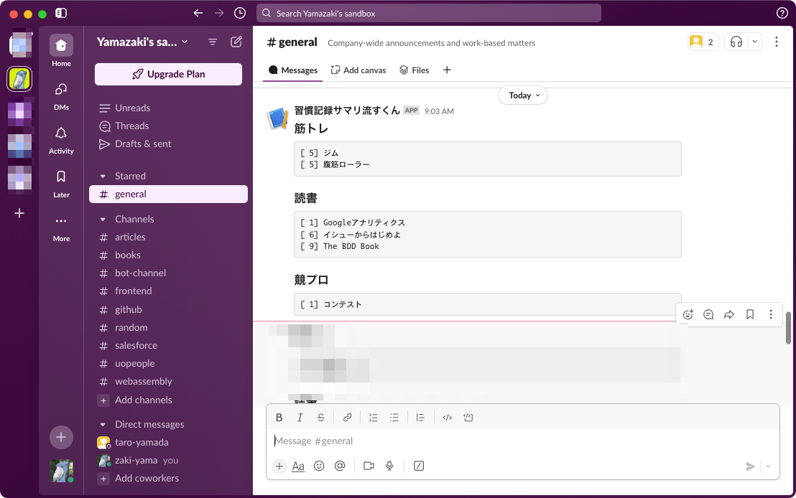

# Habitify Summary with Cloudflare Cron Trigger

[Habitify](https://www.habitify.me/) の習慣メモを集計して Slack に投稿する Bot。
Cloudflare Workers の [Cron Triggers](https://developers.cloudflare.com/workers/configuration/cron-triggers) 機能を使用。



## Usage

Habitify の API key と Slack の Incoming webhook URL が必要。

### How to deploy to production

```bash
$ npm run deploy

# 以下の Secrets を設定する
$ npx wrangler secret put HABITIFY_API_KEY
$ npx wrangler secret put SLACK_WEBHOOK_URL
```

### How to run locally

- `.dev.vars` を用意し、Habitify の API key と Slack の Incoming webhook URL を定義する。

```
HABITIFY_API_KEY="..."
SLACK_WEBHOOK_URL="https://hooks.slack.com/..."
```

- 以下のコマンドを実行する

```bash
$ npm run dev
```

- http://localhost:8787/__scheduled を開く
